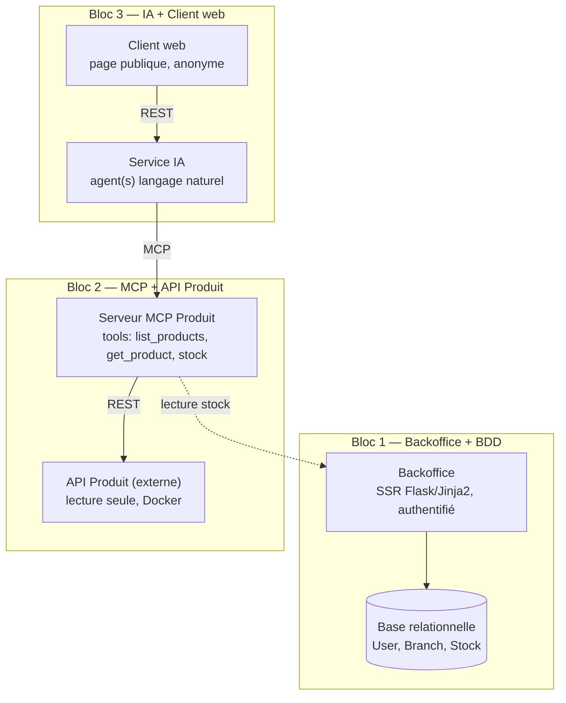

# Architecture — Système de gestion de stock multi-branches

Document de conception (Task 0). Aucune implémentation ici — objectif : que n'importe quelle
équipe puisse comprendre le design sans lire le code.

## 1. Services et responsabilités

| Service | Responsabilité |
|---|---|
| Backoffice | Interface interne authentifiée (SSR Flask/Jinja2). Auth + rôles (admin, common). Gestion des utilisateurs (admin) et du stock par branche (common user). |
| Base relationnelle | Stocke `User`, `Branch`, `Stock`. Ne stocke **aucune** donnée produit (nom, prix, description, image) — uniquement `product_id`. |
| API Produit | Service externe fourni en Docker, lecture seule. Source unique des données produit. Repo : [hbntory-products-api](https://github.com/hbtn-edu/hbntory-products-api). |
| Serveur MCP Produit | Implémenté par l'équipe. Bridge entre le Service IA et l'API Produit. Expose des tools MCP : `list_products`, `get_product`, + un tool d'accès stock (lecture). |
| Service IA | Backend indépendant du Backoffice. Contient l'agent (ou les agents) qui répond aux questions en langage naturel, via les tools du serveur MCP. |
| Client web | Page publique, anonyme, sans authentification ni mémoire de conversation. Chaque question est traitée indépendamment. |

## 2. Diagramme de services

> La flèche `MCP -> Backoffice` (lecture stock) est une hypothèse de conception à valider en
> équipe : soit le serveur MCP appelle une route de lecture exposée par le Backoffice, soit il
> lit directement la base relationnelle (cf. [decisions.md](decisions.md) pour l'arbitrage).

## 3. Flux de données : local vs externe

**Stocké localement (base relationnelle du Backoffice) :**
- `User` : id, email, password_hash, role, branch_id, is_active
- `Branch` : id, name
- `Stock` : id, branch_id, product_id (entier), quantity

**Jamais stocké localement — vient toujours de l'API Produit externe :**
- Nom, description, prix, image, catégorie, marque, fournisseur, tags du produit

Le seul lien entre les deux mondes est `product_id`, un **entier** — l'`id` numérique interne de
l'API Produit, pas le `sku` (string, ex. `HB-LAP-1001`). Ce choix a été tranché après la rédaction
initiale de ce document (cf. [decisions.md](decisions.md) "Mise à jour — accès stock du MCP") :
c'est le serveur MCP qui fait la résolution sku → id ("option C") avant d'appeler le Backoffice —
le Backoffice ne manipule donc jamais de sku, seulement des entiers opaques. Le Backoffice
lui-même appelle directement l'API Produit en lecture seule pour l'affichage (résolution
`product_id` → nom/description, cf. `app/products/client.py`), contrairement à ce qui était
supposé au moment de la conception initiale.

## 4. Accès de l'agent IA aux données produit et stock

1. L'utilisateur pose une question en langage naturel sur le Client web.
2. Le Client web envoie la question au Service IA (REST, voir decisions.md).
3. L'agent IA décide quels tools MCP appeler selon la question :
   - Besoin d'infos produit (nom, prix, existence...) → `list_products` / `get_product` sur le
     serveur MCP, qui interroge l'API Produit.
   - Besoin d'infos stock (quelle branche a X en stock, quantité disponible...) → tool stock du
     serveur MCP, qui lit la base relationnelle (via le Backoffice ou en direct — à trancher).
4. L'agent compose la réponse à partir des résultats des tools uniquement. S'il n'a pas assez
   d'information via les tools, il doit le dire explicitement plutôt que d'inventer une réponse.

## 5. API Produit — contrat externe

Repo : https://github.com/hbtn-edu/hbntory-products-api

- Lecture seule, aucune donnée de stock (conforme à la règle d'or : le stock reste uniquement
  dans notre base relationnelle, identifié par `product_id`).
- Lancement : `docker compose up --build`, accessible sur `http://localhost:5001`.
- Endpoints principaux :
  - `GET /health`
  - `GET /api/v1/products`
  - `GET /api/v1/products/search?q=keyword`
  - `GET /api/v1/products/{sku}` (ex. : `HB-LAP-1001` — identifiant = `sku`, pas l'`id` numérique interne)
  - `GET /api/v1/categories`
  - `GET /api/v1/suppliers`
- Données produit : identifiants, noms, descriptions, marques, catégories, fournisseurs, prix, tags.
- Paramètres de test disponibles : `simulate_delay_ms`, `force_error` (utile pour tester la
  robustesse du Backoffice/Service IA face à la latence ou aux erreurs de l'API Produit).

### Liste des produits (seed de référence)

Le `sku` ci-dessous est un identifiant lisible fourni par l'API Produit, utile pour repérer un
produit dans cette table — mais ce n'est **pas** ce qui est stocké dans `Stock.product_id` (voir
§3 : c'est l'`id` numérique interne de l'API Produit, que le serveur MCP résout à partir du
`sku` avant d'appeler le Backoffice).

| sku (repère lisible) | Nom | Catégorie |
|---|---|---|
| HB-LAP-1001 | Holberton Student Laptop 14 | Laptops |
| HB-LAP-1002 | Holberton Student Laptop 16 | Laptops |
| HB-MON-2101 | 27 inch Lab Monitor | Displays |
| HB-MON-2102 | 24 inch Compact Monitor | Displays |
| HB-DCK-3001 | USB-C Teaching Dock | Accessories |
| HB-KBD-4101 | Mechanical Keyboard EN | Accessories |
| HB-KBD-4102 | Compact Keyboard ES | Accessories |
| HB-MSE-4201 | Wireless Mouse | Accessories |
| HB-CAM-5101 | HD Webcam | Video |
| HB-MIC-5201 | USB Classroom Microphone | Audio |
| HB-HDS-5301 | Noise-Isolating Headset | Audio |
| HB-RTR-6101 | Lab Router AC1200 | Networking |
| HB-SWT-6201 | 8-Port Managed Switch | Networking |
| HB-CBL-6301 | Ethernet Cable 2m | Networking |
| HB-SSD-7101 | External SSD 1TB | Storage |
| HB-SSD-7102 | External SSD 2TB | Storage |
| HB-USB-7201 | USB Drive 64GB | Storage |
| HB-USB-7202 | USB Drive 128GB | Storage |
| HB-PWR-8101 | Laptop Charger 65W | Power |
| HB-PWR-8102 | USB-C Charger 100W | Power |
| HB-PWR-8201 | Surge Protector 6-Outlet | Power |
| HB-CHR-9101 | Ergonomic Lab Chair | Furniture |
| HB-DSK-9201 | Compact Student Desk | Furniture |
| HB-WHT-9301 | Mobile Whiteboard | Furniture |
| HB-BAG-1011 | Laptop Sleeve 14 | Accessories |
| HB-BAG-1012 | Laptop Backpack | Accessories |
| HB-DEV-1111 | Single Board Computer Kit | Development Kits |
| HB-DEV-1112 | Sensor Starter Kit | Development Kits |
| HB-DEV-1113 | Breadboard Pack | Development Kits |
| HB-ACC-1211 | HDMI Cable 1.5m | Accessories |
| HB-ACC-1212 | USB-C Cable 1m | Accessories |
| HB-OLD-1301 | Legacy VGA Adapter | Accessories |
| HB-SEC-1401 | RFID Access Card Pack | Security |
| HB-SEC-1402 | USB Security Key | Security |
| HB-PRN-1501 | Label Printer | Operations |
| HB-LBL-1502 | Inventory Label Roll | Operations |
| HB-SCN-1601 | Barcode Scanner USB | Operations |
| HB-TAB-1701 | Inventory Tablet 10 | Mobile Devices |
| HB-TAB-1702 | Protective Tablet Case | Mobile Devices |
| HB-LGT-1801 | Desk Lamp LED | Furniture |

> Note : cette liste vient de `data/products.json` du repo API Produit (branche `main`, juillet
> 2026). Si l'API évolue côté Bloc 2, revalider cette table plutôt que de la considérer figée.

## Voir aussi

- [decisions.md](decisions.md) — choix de communication (REST/SSR, REST vs WebSocket, transport MCP)
- [mvp.md](mvp.md) — définition du MVP
